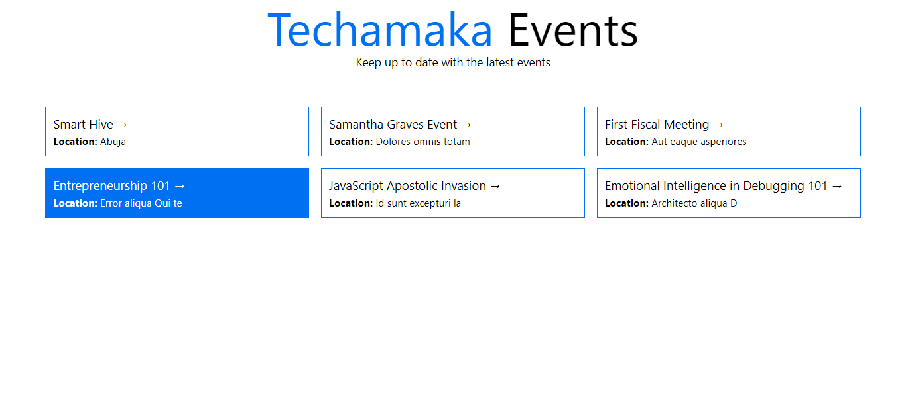
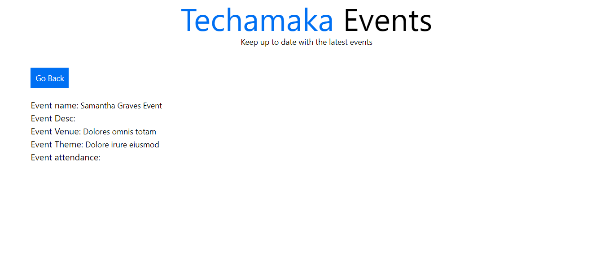

# Techamaka - Frontend Web Task Solution

## The Challenge
Frontend Web: Technical Task: You are to create a landing page using Nextjs and Tailwindcss and GraphQL. It is an events listing page, with a detail page. Enter below the link to your public github repo for the task. Note: when the localhost url as shown in the image above is changed the theme colour of the page should also change. Enter the link to the public github repo below... Endpoints are listed here: [API link](https://dev.peddlesoft.com/graphql)

___

## Screenshot

`Landing page`



`Detail page`



### Notable codeblocks

`Get events from api`

```javascript
const eventQuery = `
{
  events{
    id
    name
    venue
  }
}
`

export const getStaticProps = async ()=> {
  const res = await fetch('https://dev.peddlesoft.com/graphql', {
    method: 'POST',
    headers: {
      Accept: 'application/json',
      'Content-Type': 'application/json',
    },
    body: JSON.stringify({query: eventQuery})
  })
  const data = await res.json();
  
  return {
    props: {
      data: data.data.events
    }
  }
}
```

`Get event detail`

```javascript
export const getServerSideProps = async (context) => {
  const eventid = context.params.id
  const eventDetailQuery = `
{
    eventById(id: ${eventid}){
      id
      name
      theme
      description
      venue
      attendance
      flyer
    }
  }
`
  const res = await fetch('https://dev.peddlesoft.com/graphql',
    {
      method: "POST",
      headers: {
        "Content-Type": "application/json",
      },
      body: JSON.stringify({ query: eventDetailQuery }),
    }
  );
  const data = await res.json();

  return {
    props: {
      data: data.data.eventById,
    },
  };
};

```

### Built with

- [Next.js](https://nextjs.org/) - React framework
- [Tailwind css](https://tailwindcss.com/) - css framework
